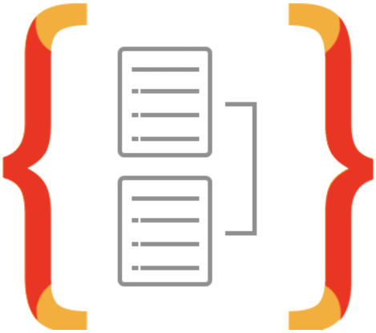
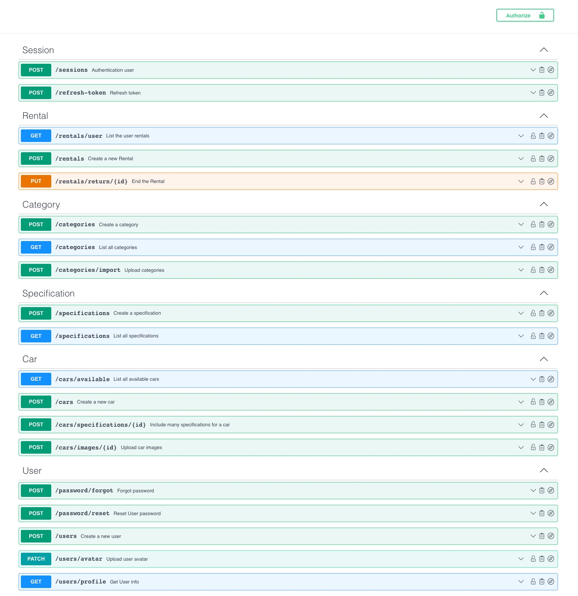

### rentx

[]()
[](https://github.com/wladimirgrf/certification/commits/master)
[](https://github.com/wladimirgrf/certification/issues)
[]()

Project developed for the Rocketseat Ignite (_Node.js Path_). This application is a simple REST API and It was built to manage car rental routines.

## 🌍 Ecosystem

Below the technologies, used to build this API:

|                      Name                                   |                         Status                          |
|:-----------------------------------------------------------:|:-------------------------------------------------------:|
| |  |
| |  |
| | |
| |  |
| |  |
| |  |
| |  |
| |  |
| |  |
| |  |
| |  |
| |  |
| |  |
| |  |
| |  |

## ⚙️ Services


## 🧱 ERM


## ▶️ Getting started

**Requirements**

- [Node.js](https://nodejs.org/en/)
- [Docker Compose](https://docs.docker.com/compose/install/)

**Clone the project**
```bash
$ git clone https://github.com/wladimirgrf/rentx.git && cd rentx
```

**Install the Project dependencies**
```bash
$ npm install
```

**Environment configuration**
```bash
# Make a copy of '.env.sample'
# Fill both files with YOUR environment variables.
$ cp .env.sample .env
$ cp .env.sample .env.test
```

**Run the containers**
```bash
$ docker-compose up -d
```

**Migrations**
```bash
$ npm run typeorm migration:run
```

**Launch the Application**
```bash
$ npm run dev
```

>The API will be launch at `http://localhost:3333/`<br>
>Documentation available at `http://localhost:3333/api-docs`


## 🤝 Contributing

**Fork the repository and clone your fork**

```bash
$ git clone fork-url && cd rentx
```

**Create a branch for your edits**
```bash
$ git checkout -b new-feature
```

**Make the commit with your changes**
```bash
$ git commit -m 'feat: New feature'
```

**Send the code to your remote branch**
```bash
$ git push origin new-feature
```

Create a pull request with your version. <br>
After your pull request is merged, you can delete your branch.


## 📝 License

This project is licensed under the MIT License - see the [LICENSE](LICENSE) file for details.

